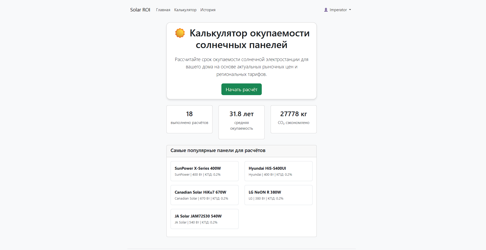
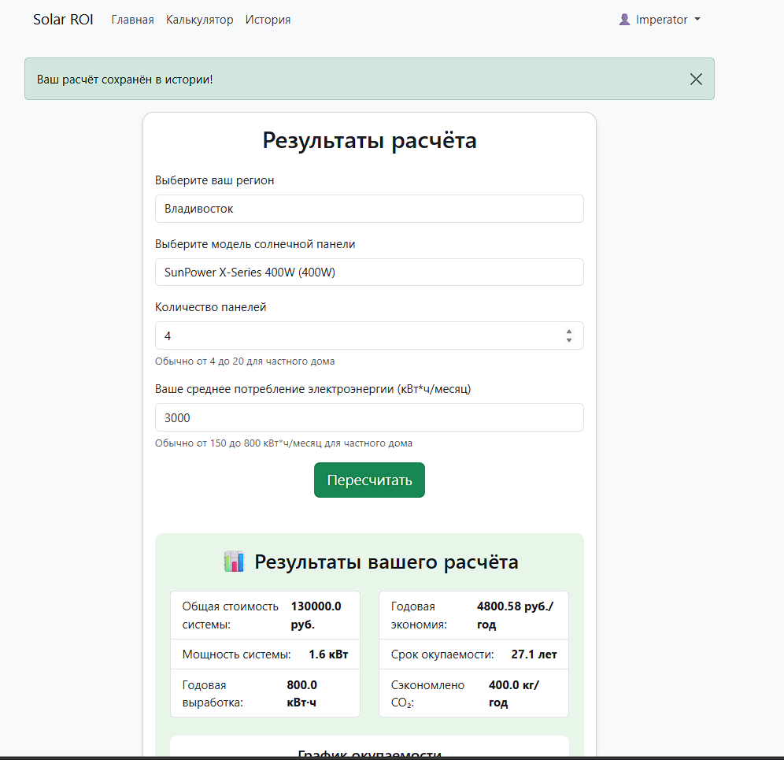
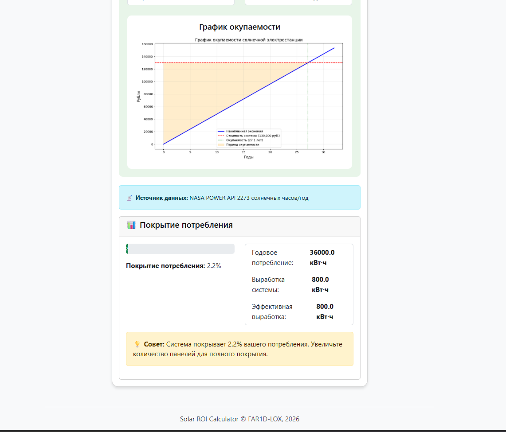
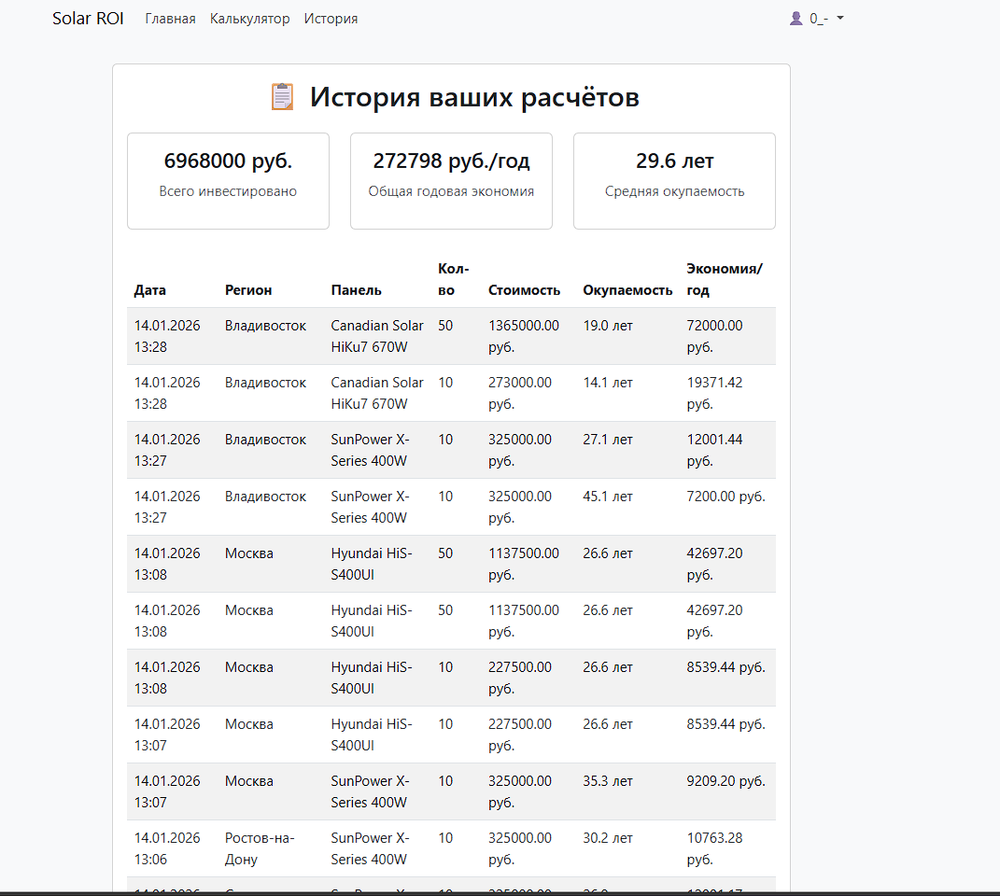

# Solar ROI Calculator ☀️
Веб-сервис для расчёта окупаемости инвестиций в солнечные панели
Помогает домовладельцам определить срок возврата инвестиций в солнечную энергетику на основе актуальных рыночных цен, региональных тарифов и реальных данных по солнечной инсоляции. Сервис автоматически рассчитывает экономию, срок окупаемости и экологический эффект.

## 📊 Технологии
Backend: Python 3.13, Django 6.0.1

Database: SQLite (разработка), готово к PostgreSQL

Data Science: Pandas 2.3.3 (анализ данных), Matplotlib 3.10.8 (графики)

API Integration: NASA POWER API (солнечная радиация), requests 2.32.5

Frontend: Bootstrap 5.3.0, Django Templates

Deployment: PythonAnywhere

## 🖼️ Скриншоты
Главная страница со статистикой

На главной отображается общая статистика по всем расчётам: количество выполненных расчётов, средняя окупаемость, сэкономленный CO₂

Калькулятор окупаемости с графиком

Пользователь выбирает регион, модель панели, указывает потребление — система показывает детальный расчёт и график окупаемости

История расчётов пользователя

Авторизованные пользователи видят все свои предыдущие расчёты

## 🚀 Как запустить проект локально
1. Клонируйте репозиторий:
git clone https://github.com/FAR1D-lox/solar_roi_calculator.git
2. Перейдите в него:
cd solar_roi_calculator
3. Создайте виртуальное окружение:
python -m venv venv 
4. Активируйте виртуальное окружение:
venv\Scripts\activate
5. Установите зависимости:
pip install -r requirements.txt
6. Настройте базу данных:
python manage.py migrate
python manage.py seed_data
7. Создайте суперпользователя:
python manage.py createsuperuser
8. *Следуйте инструкциям для создания учётной записи администратора*
9. Запустите сервер разработки:
python manage.py runserver
10. Откройте проект в браузере:
Перейдите по адресу: http://127.0.0.1:8000/ или localhost:8000/

## 🔧 Быстрый старт
### Как гостевой пользователь:

Перейдите на /calculate/

Выберите регион (например, Москва)

Выберите модель солнечной панели

Укажите количество панелей и потребление

Получите расчёт окупаемости с графиком

### Как авторизованный пользователь:

Зарегистрируйтесь на /register/

Войдите в систему

Все ваши расчёты будут сохраняться в истории

### Как администратор:

Войдите в админку: /admin/

Управляйте каталогом панелей, регионами и просматривайте все расчёты

## 📈 Ключевые возможности:

### Реальные данные NASA
Сервис интегрирован с NASA POWER API для получения актуальных данных по солнечной инсоляции в любой точке мира. Данные кешируются на 24 часа для оптимизации производительности.

### Умные расчёты
Учёт потребления: Экономия рассчитывается только от фактически используемой энергии

### Региональные особенности
Разные тарифы на электроэнергию для каждого региона России

### Визуализация
Автоматическая генерация графиков окупаемости

### Прогресс-бар покрытия потребления

## 🏗️ Архитектура проекта
### Модели данных:
SolarPanel - каталог солнечных панелей с техпараметрами

Region - регионы с тарифами и солнечными часами

Calculation - история расчётов пользователей

### Сервисный слой:
EnergyDataClient - работа с внешними API (NASA, поставщики)

SolarROICalculator - бизнес-логика расчётов с использованием pandas

## 🌐 Деплой
Ссылка на деплой: https://far1d.pythonanywhere.com/